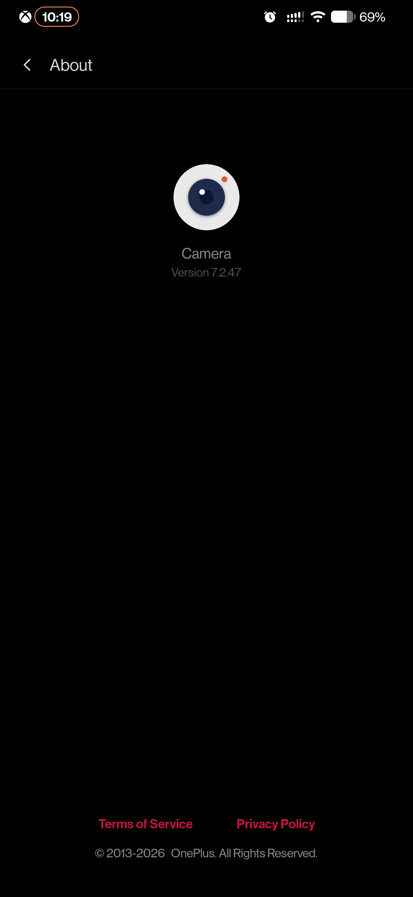
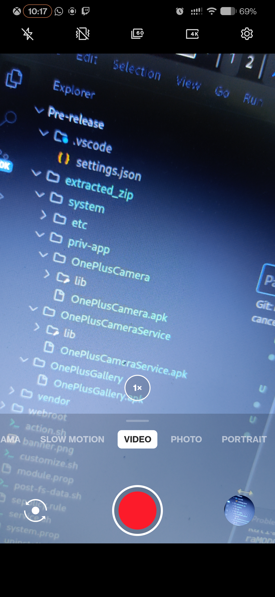
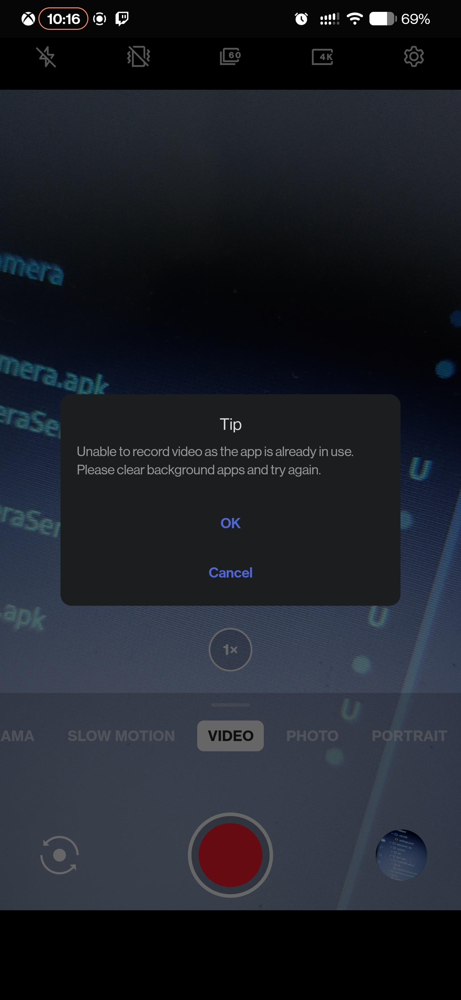

# OOS Camera Port for OnePlus 7/7 Pro (Android 15 & 16)

  

  
  
  

  
  
  

  <i>* Note: The download counter automatically tracks both manual ZIP downloads and automated in-app updates via Magisk/KernelSU.</i>

---

## ⚠️ Disclaimer

This is an **unofficial port** of the OnePlus OxygenOS camera for the **OnePlus 7 and 7 Pro (guacamole/guacamoleb)**, specifically adapted for **Android 15 and 16**.

> [!IMPORTANT]
> This is an experimental version. Use at your own risk.

## 📱 Module Overview (v7.2.4)

This Magisk module enables the native OxygenOS camera experience on AOSP-based Custom ROMs. It aims to restore the original post-processing and camera features that are often lost when leaving stock OOS.

### 📦 Included Applications

The module now installs three core applications to ensure full stability and functionality:

|  |  |  |
| :---: | :---: | :---: |
| **OnePlus Camera** | **Camera Service** | **OnePlus Gallery** |
| The main photography app | Essential background logic | Native media editor |

### ⚡ Compatibility Note

* **Latest Updates:** Please note that the most recent updates have **only been tested and confirmed working on Android 16**, specifically on the **crDroid 12.7** ROM.
* **Requirements:** Magisk 24.0+ or KernelSU.

### ⚙️ Module Web UI Updates

Inside the module's Web UI, there is a new configuration option. You can now easily change the update channel from **latest** (stable) to **pre-release** (beta) to test the newest experimental builds directly from the app.

---

## 🛠️ Working Features & Known Issues

### ✅ What's Working

Most core functionalities are working, though you should keep in mind it's an experimental port:

* **Photo Capture:** Native OxygenOS quality.
* **Video Recording:** It works on modern builds, but you may still encounter some errors, glitches, or instability occasionally depending on the libraries.
* **Pro Mode:** Manual controls are working.
* **Portrait Mode:** Accurate edge detection and bokeh.
* **Panorama:** Seamless stitching.
* **Slow Motion & Time-Lapse:** Functional.
* **Gallery Integration:** Native viewing and editing is working smoothly.

### ⚠️ Known Bugs

* **General Stability:** As an unofficial port, random crashes or edge-case bugs can still occur.
* **Telephoto Lens Issue:** Taking a photo at **3x zoom or higher** results in a completely green image.

---

## 📷 Screenshots

  
  &nbsp;
  
  &nbsp;
  

---

## 🚀 Installation Guide

1. **Download:** Get the latest ZIP from the Releases page.
2. **Flash:** Open **Magisk Manager** -> Modules -> Install from storage.
3. **Reboot:** Restart your device to apply systemless changes.

## 🗑️ Uninstallation

* **Via Magisk:** Open Magisk Manager, find the module, and select "Remove". Reboot.
* **Via Recovery:** Flash the `uninstall.sh` script if you have access to a custom recovery.

---

## 🤝 Credits & Acknowledgments

* **@quince, Codecity001 & Infinity-X-Devices:** Huge thanks to @quince for pointing out and providing the essential vendor trees and blobs needed to make this port possible. Repositories referenced:
  * [Infinity-X-Devices/device_oneplus_guacamoleb](https://github.com/Infinity-X-Devices/device_oneplus_guacamoleb)
  * [Codecity001/device_oneplus_sm8150-common-1](https://github.com/Codecity001/device_oneplus_sm8150-common-1)
  * [Codecity001/hardware_oneplus-1](https://github.com/Codecity001/hardware_oneplus-1)
  * [Codecity001/vendor_oneplus_guacamoleb-1](https://github.com/Codecity001/vendor_oneplus_guacamoleb-1)
  * [Codecity001/vendor_oneplus_sm8150-common-1](https://github.com/Codecity001/vendor_oneplus_sm8150-common-1)
* **Current Development (mega067):** Built entirely from scratch using the updated vendor, allowing a successful migration to the native **OnePlus Camera v7.2.4** with working A16-ready HALs.
* **SebastianWijatyk (XDA):** The earliest conceptual versions of this port were based on their initial [Android 12L Magisk module](https://xdaforums.com/t/new-oneplus-oos-camera-for-android-12l-op7-and-7pro-magisk-module.4455707/).
